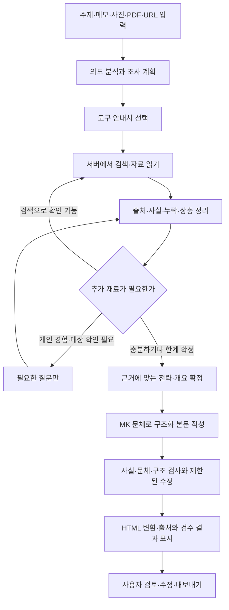

# MK 문체를 유지하는 주제 적응형 포스팅 설계안

작성일: 2026-09-13
상태: 논의용 초안. 실행 코드 변경 전 계획.

목표는 사용자가 어떤 주제와 자료를 주더라도, 시스템이 필요한 조사를 수행하고 근거에 맞는 전략·구성을 선택해 MK의 문체로 초안을 완성하는 것이다. 새로운 주제를 지원하기 위해 매번 거대한 전용 프롬프트를 추가할 필요가 없도록 한다.

## 1. 확정 요구와 잠정 가정

사용자가 명시한 요구:

- MK의 문체·페르소나는 반드시 보존한다.
- 주제와 자료에 반응해 전략과 포스팅 구성을 자동으로 결정한다.
- 네이버 검색·TMDB 등 자료 검색 API를 wiki 형태로 제공하는 구조를 검토한다.
- 이번 작업은 설계와 구현 계획 수립이다.

답변 전 잠정 가정:

- 여기서 반응형은 주제·자료·경험·검색 결과에 따라 작성 방식을 조정한다는 의미다. 모바일 표시 호환성도 별도로 유지한다.
- wiki는 AI가 도구의 용도와 한계를 읽고 선택하는 도구 안내서다. 문서만으로 API가 실행되는 것은 아니므로 서버의 실행 함수와 연결한다.
- 1차 자동화 범위는 주제 입력부터 검토 가능한 초안까지다. 경험이 필요한데 제공되지 않은 경우에만 질문한다.
- 주제 자동 발굴·예약 실행은 이후 단계다. 네이버 자동 발행 연동은 초안 자동화와 별도 범위로 둔다.
- 범용 주제를 입력받되, 충분한 근거가 없는 주제를 조사 완료로 표시하거나 경험담으로 만들어내지 않는다.

## 2. 현재 코드에서 재사용할 것과 보완할 것

| 현재 자산 | 재사용 방식 | 선행 보완 |
|---|---|---|
| `lib/prompts/base.ts` | MK 말투·문단 호흡·금지어·문체 참조 | 모든 생성 경로에 공통 적용, 고정 기준과 참조 예시 분리 |
| `lib/prompts/profile.ts` | 누적 취향·대표 표현 | 자동 학습이 고정 페르소나를 덮어쓰지 못하게 분리 |
| `lib/prompts/movie.ts` 등 | 유형별 편집 노하우와 HTML 예시 | 고정 글 틀을 선택 가능한 편집 규칙·블록으로 전환 |
| `lib/naver-search.ts` | 뉴스 검색 실행 함수 | 뉴스 원문 URL·검색 요약·검색 시점 보존, 웹문서 검색 확장 |
| `lib/tmdb.ts` | 영화·TV 검색 및 상세·이미지 | 실제 작성에서 mock 사용 차단, 작품 식별, 누락값·추정값 표시 |
| `lib/kobis.ts` | 박스오피스 조회 | 집계 기준일과 수치의 근거 보존 |
| `lib/naver-datalab.ts` | 주제별 검색 추이 | 상대 지수를 절대 검색량과 구분, 비교 기간·그룹 보존 |
| RSS·Sheets 과거 글 | 문체·과거 콘텐츠 검색 | 작성자 확정본과 미검토 AI 초안을 구분해 참조 |
| `lib/post-lint.ts` | 기계 검수 | 프롬프트와 동일 규격 사용, 검사 결과 화면 전달 |
| Postgres·영화소식 수집 | 실행 이력·초안 저장·향후 예약 작업 | 범용 작업 저장과 재개 상태 추가 |

현재 `/write`와 `/smart-write`는 모두 워크플로우를 사용한다. 새 엔진은 우선 `/smart-write`에 연결하고 기존 작성 흐름과 비교한 뒤 단계적으로 통합한다.

선행 수정 대상은 자동 분류 시 가짜 selectedType 주입, 원제·국가·감상평 등 입력 누락, 문체 적용 누락, 검수 경고 미표시, 클래스101의 상충 지시다. 작업 폴더에 이미 변경된 프롬프트가 있으므로 실제 구현 시 해당 변경을 보존한 상태에서 기준 버전을 기록한다.

## 3. 고정 페르소나와 가변 전략

| 층 | 포함 내용 | 변경 방식 |
|---|---|---|
| MK 고정 기준 | 말투, 분석 태도, 인사말·상투어 금지, 강조 방식, 문단 호흡 | MK의 명시적인 설정 변경으로만 수정 |
| 문체 예시 | MK가 직접 쓴 글 또는 확정한 최종본의 대표 문단 | 선정·버전 기록, 초안 자동 편입 금지 |
| 누적 취향 | 장르·공간 취향, 자주 쓰는 관점 | 인터뷰에서 근거와 함께 누적, 일회성 의견 일반화 금지 |
| 이번 글의 경험 | 실제 감상평, 관람·방문 여부, 역할, 현장 메모 | 이번 사용자 입력을 기준으로 유지 |
| 이번 글의 전략 | 독자, 목적, 훅, 논점, 순서, 분량, 이미지 역할 | 조사 결과와 자료량에 따라 조정 |

주제별로 바뀌는 것은 정보·감상의 비중과 글의 구조다. 작성자의 정체성을 다른 역할로 바꾸지 않는다. 예를 들어 영화 글은 해석 비중을 높이고 지원사업 안내는 조건·일정 비중을 높이되 MK의 말투와 가독성 기준을 유지한다.

현재 고정 기준은 별도 검토 없이 문장 자체를 새로 정의하지 않는다. 우선 기존 규칙을 추출해 기준으로 사용한다. 핵심 규칙을 프롬프트에 항상 넣고 기계 검사와 문체 평가를 함께 수행한다. 자연어 문체의 완전한 보존 여부를 자동 점수 하나로 보장하지 않으며, MK의 수정량과 비교 평가를 완료 기준에 포함한다.

이번 글의 경험은 과거 취향으로 대체하지 않는다. 과거에 특정 감독을 좋아했다고 해서 이번 작품도 좋아했다고 쓰지 않는다. 검색 자료는 문체와 개인 경험을 변경하는 지시로 취급하지 않는다.

## 4. 실행 흐름

처음에는 잠정적인 의도와 조사 질문만 정한다. 조사 전에 훅과 결론을 고정하지 않는다. 조사 결과가 처음 예상과 다르면 근거를 남기고 전략을 수정한다.

검색은 무한 반복하지 않는다. 초기 제안은 검색 보완 최대 2회, 본문 수정 최대 2회이며 호출 수·시간·토큰 예산은 설정으로 둔다. 중복 검색과 같은 실패의 반복을 차단한다. 예산 소진 시 확보된 범위, 생략한 항목, 사용자 확인이 필요한 점을 반환한다.

## 5. 도구 wiki와 실행 계층

wiki는 도구 선택을 돕는 문서이며, 서버의 등록된 실행 함수가 실제 API를 호출한다. AI가 문서의 임의 코드를 실행하거나 URL과 인증을 직접 조립하는 구조로 만들지 않는다.

도구별 문서에 포함할 항목:

- 도구 ID·버전·요약, 어떤 질문을 해결하는지.
- 사용해야 하는 상황과 부적합한 상황.
- 입력 스키마, 필수 값, 검색어 구성 예시.
- 반환 필드, 출처 종류, 최신성·정확성의 한계.
- 빈 결과·권한 오류·호출 한도 초과 시 대처.
- 호출 예산·캐시·원문 접근 및 이미지 사용 조건.
- 공식 문서 URL과 문서 확인일.

전체 안내서 대신 짧은 도구 목록을 먼저 제공하고 해당 작업에 필요한 상세 설명만 로드한다. 실행 스키마는 코드의 단일 정의에서 도출해 문서와 함수가 어긋나지 않게 한다. 소수의 도구로 시작하며 초기에는 벡터 DB나 별도 위키 서비스를 필수로 두지 않는다.

예시: `naver.news.search`

- 목적: 현재 이슈의 보도 내용과 원문 후보 탐색.
- 입력: 검색어, 관련성/최신순, 결과 수.
- 출력: 제목, 원문 URL, 검색 결과 URL, 요약, 보도일, 검색일.
- 한계: 검색 요약은 기사 전문이 아니다. 사실 확인 수준을 snippet으로 기록한다.
- 다음 행동: 핵심 수치·발언은 공식 자료나 접근 가능한 원문으로 확인한다.
- 실패: unavailable / error / empty를 구분해 다른 출처로 전환한다.

API 키는 서버에만 유지하며 wiki나 모델 입력에 포함하지 않는다. 외부 원문 읽기는 공개 HTTP(S) 문서로 제한하고 내부망·로컬 주소와 해당 주소로의 리디렉션을 차단한다. 본문에 포함된 명령문은 자료로만 취급한다.

## 6. 자료 도구의 역할

| 도구 | 담당 역할 | 도입 순서 |
|---|---|---|
| 첨부 PDF·텍스트·사용자 URL | 직접 제공한 사실과 기록 | 1차 |
| MK 확정 글·문체 예시 | 말투·관점·기존 관련 글 참조 | 1차 |
| 네이버 웹문서 검색 | 일반 주제의 공식 출처 후보 탐색 | 1차 |
| 네이버 뉴스 검색 | 시의성·최근 보도 후보 탐색 | 1차 |
| 공개 원문 읽기 | 검색 후보에서 접근 가능한 본문·공고 확인 | 1차 |
| TMDB 검색·상세 | 영화·TV 식별, 작품 정보·이미지 | 1차 |
| KOBIS | 국내 박스오피스 수치와 기준일 | 2차 |
| 네이버 지역 검색 | 업체·장소 식별과 주소 후보 | 2차 |
| 네이버 블로그 검색 | 독자 질문·검색 결과 구성·경험담 관찰 | 2차 |
| DataLab | 후보 키워드의 상대적 관심 추이 | 2차 |
| 분야별 공공·기관 API | 문화행사·정책 등 반복 수요가 확인된 분야 | 이후 |

네이버 검색은 분야별 검색 결과를 제공한다. 웹문서 응답의 description은 요약 패시지이므로 원문 수집·읽기와 구분한다. 공개 원문 접근이 실패하면 PDF·본문 입력이나 다른 출처를 사용하고 읽었다고 표시하지 않는다. [네이버 검색 소개](https://developers.naver.com/products/service-api/search/search.md), [웹문서 응답 명세](https://developers.naver.com/docs/serviceapi/search/web/web.md)

TMDB는 작품 검색 뒤 ID를 통해 상세를 조회하는 흐름을 사용한다. 제목·연도·영화/TV 구분으로 후보를 좁히고 동명이작이 남으면 사용자에게 확인한다. [TMDB 검색·상세 흐름](https://developer.themoviedb.org/docs/search-and-query-for-details)

DataLab은 기간 내 최고값을 기준으로 한 상대 지수를 제공한다. 이를 월간 절대 검색량이나 상위 노출 보장 근거로 사용하지 않는다. [DataLab 공식 설명](https://developers.naver.com/products/service-api/datalab/datalab.md)

블로그 검색은 다른 사람의 경험을 MK의 경험으로 가져오는 용도로 사용하지 않는다. 이미지 검색 결과나 URL 확보만으로 이미지 사용 권한·장면 내용이 확인됐다고 판단하지 않는다. API와 자료의 이용·표시 조건은 도구별 확인 항목으로 관리한다.

## 7. 자료를 글로 바꾸는 중간 데이터

원문을 모두 붙인 거대한 프롬프트 대신 다음 데이터를 단계별로 저장한다.

| 데이터 | 핵심 필드 | 목적 |
|---|---|---|
| `WritingBrief` | 주제, 목적, 독자, 시간·지역, 첨부, 선호, 경험 상태 | 사용자의 요청 보존 |
| `ResearchPlan` | 확인할 질문, 대상 후보, 선택 도구, 검색어, 종료 조건 | 조사 선택 이유 기록 |
| `SourceRecord` | sourceId, URL/파일 ID, 발행일·수집일·대상 기간, 본문/요약 구분, 추출 위치 | 출처 추적 |
| `EvidenceItem` | 주장, sourceIds, 근거 구간, 확인/상충/추정 상태 | 본문의 사실별 근거 관리 |
| `ExperienceNote` | 사용자 발언, 역할, 실제 행동·감상, 원문 위치 | 개인 경험 날조 방지 |
| `ArticleStrategy` | 목적, 핵심 질문, 독자, 키워드, 훅, 논점, 섹션 계획, 분량, 제외 항목 | 근거에 맞춘 편집 방향 |
| `ArticleDocument` | 제목 후보, 섹션·블록, 이미지 슬롯, sourceIds, 경험 참조 | 본문과 HTML 분리 |
| `QualityReport` | 규칙 위반, 근거 부족, 문체 평가, 수정 내역, 남은 확인 | 검토 가능한 결과 |

sourceId가 존재한다는 것만으로 사실 검증에 통과시키지 않는다. 근거 구간이 해당 주장을 실제로 뒷받침하는지도 검사한다. 검색 제목·요약만 본 자료를 원문 확인으로 승격하지 않는다. 같은 보도자료를 재배포한 여러 기사도 독립적인 근거 여러 개로 세지 않는다.

날짜·신청 조건·가격 등의 충돌은 최신 공식 공지, 대상 지역·기간, 정정 여부를 비교한다. 해소되지 않은 중요한 충돌은 단정하지 않고 검토 화면에 남긴다. 출처 목록은 실제 본문에 사용한 근거를 기준으로 만든다.

## 8. 주제에 따라 달라지는 편집 전략

기존 PostType은 당분간 저장·화면 호환과 편집 기본값으로 유지한다. 새로운 엔진의 전략은 분야, 목적, 필요한 경험, 자료량, 시의성, 표현 블록의 조합으로 결정한다. 기존 유형에 없는 주제를 review로 강제 분류하지 않는다.

| 입력 예시 | 조사와 질문 | 선택할 글 구성 |
|---|---|---|
| 신작 영화 감상평 + 작품명 | 작품 정보 확인, 감상에 부족한 구체적 장면만 질문 | 사용자의 핵심 감상 중심 리뷰 |
| 대구 전시 일정 정리 | 주최 측 공지·기간·장소·예매 정보 | 일정·대상·방문 준비 안내 |
| 제품 A와 B 비교 | 공식 제원·사용 조건·시점별 가격 확인 | 기준별 비교와 선택 가이드 |
| GV 진행 후기 + 대화록 | MK 역할과 소감 확인, 작품 배경 보강 | 진행 경험·발언·개인적 해석 |
| 관심 분야의 개념 설명 | 공식 문서·신뢰 가능한 기초 자료 | 쉬운 정의·사례·오해·활용 |
| 일상 메모와 사진 | 제공된 메모 우선, 불필요한 외부 검색 생략 | 사진 흐름에 따른 개인 기록 |

개인 경험이 없는 후기 요청에서는 필요한 경험만 묻는다. 사용자가 경험을 제공하지 않으면 정보형 구성 전환을 제안하거나 해당 단락을 보류하고, 직접 사용·관람한 것으로 쓰지 않는다. 이미지 픽셀을 분석하지 않았다면 파일명·메모 이상의 장면 묘사를 요구하지 않는다.

## 9. 작성·HTML·검수 책임

작문 단계는 MK 문체의 문장, 핵심 논점, 섹션과 근거 연결을 만든다. 렌더러는 제목 박스·표·콜아웃·이미지 슬롯·해시태그·하단 시그니처를 생성한다. 사용자의 실제 문장은 불필요하게 전면 재작성하지 않는다.

처음에는 현재 HTML 경로를 유지하면서 중간 데이터를 도입하고, 이후 문단·섹션 헤더·정보표·콜아웃·인용·이미지 슬롯 등 소수 블록부터 구조화한다. 자유로운 설명은 문단 블록으로 충분히 표현할 수 있어야 한다. 기존 4~5개 소제목 같은 규칙은 근거량에 따른 권장값으로 전환하되 MK 문체 기준은 유지한다.

검수는 세 종류로 나눈다.

1. 기계 검사: 출력 스키마, 제목 수·길이, 해시태그 위치·개수, 필수 필드, 이미지 누락·중복, 허용 HTML, 출처 참조 유효성.
2. 근거·경험 검사: 확인되지 않은 사실, 날짜·수치 충돌, 사용자에게 없는 체험, 문체 참조 글의 고유 사실 유입.
3. 편집 평가: MK 말투·리듬·원문 보존, 단락 반복, 논점의 구체성, 전략과 본문의 일치.

검수에서 문제 부분만 수정한다. 수정된 블록은 사실과 문체를 다시 확인한다. 수정 한도를 넘긴 문제는 숨기지 않는다. 문체 불일치나 핵심 사실 미확인을 해결하지 못한 초안은 완료본과 구분해 표시한다.

클래스101 같은 협업 글은 공통 MK 문체 위에 캠페인별 조건을 별도 적용한다. 가격·혜택·필수 표기에는 근거와 적용 기간을 연결하고, 글 구조와 충돌하는 조건은 검수 결과로 노출한다.

## 10. 화면과 실행 안정성

입력은 주제·자유 메모·자료 첨부를 기본으로 한다. 목적·독자·분량은 자동 판단값을 제공하되 수정할 수 있게 한다. 매 단계의 승인을 필수로 만들지 않고 전략은 펼쳐서 확인·수정할 수 있게 한다.

진행 화면에는 알아보기 쉬운 상태를 보여준다: 자료 찾는 중 → 출처 확인 중 → 글 구성 중 → 작성 중 → 문체·사실 점검 중. 필요한 경우에만 경험·대상 확인 질문을 표시한다.

결과 화면에는 본문 미리보기, 제목 후보, 실제 사용 출처, 남은 확인 사항, 부분 수정 기능을 제공한다. 고유 사실과 원문을 유지한 채 '도입만 변경', '더 짧게', '내 표현 더 살리기'가 가능해야 한다.

조사·인터뷰·생성은 하나의 긴 HTTP 요청에 모두 넣지 않는다. `writing_runs`, `writing_steps`, `writing_sources`, `writing_artifacts` 등에 단계별 상태와 결과를 기록하고 작업 ID로 진행 상태를 조회한다. 상태는 queued / running / awaiting_input / completed / needs_review / failed / cancelled로 구분한다.

초기에는 순차 단계 실행과 체크포인트를 구현한다. 이후 서버 작업 실행기를 연결해 브라우저를 닫아도 재개할 수 있게 한다. 중복 실행 방지 키, 작업 잠금·만료, 단계별 재시도·취소, 마지막 성공 결과 재사용을 포함한다. SSE는 진행 표시 수단으로 사용하고 영속 상태의 원본으로 사용하지 않는다.

프롬프트·페르소나·도구·전략 버전, 자료 시점, 모델 설정, 호출 횟수·토큰·시간을 기록한다. API 미설정·검색 0건·서비스 장애를 구분하고 실제 작성에서 예제 데이터를 조사 결과로 사용하지 않는다.

## 11. 구현 순서와 완료 기준

| 단계 | 실제 사용할 수 있는 결과 | 완료 기준 |
|---|---|---|
| 0. 기준 보존과 선행 결함 수정 | 기존 작성 흐름의 문체·입력·검수 일관성 개선 | 기준 프롬프트 기록, 모든 경로 문체 적용, 입력 누락 및 가짜 유형 기본값 제거, 경고 표시 |
| 1. 도구 안내서·출처 연결 | 한 주제로 네이버 웹/뉴스와 TMDB를 선택해 조사 자료 생성 | 도구 선택 이유·출처·읽기 수준 저장, 오류/빈 결과/mock 구분, 공개 원문 확인 경로 |
| 2. 범용 전략부터 MK 초안까지 | 영화 외 주제도 전략·개요·본문·검토 결과 생성 | 일반 설명·로컬 정보·영화 감상 사례 완주, 필요한 경험만 질문, 고정 유형 강제 없음 |
| 3. 구조화 출력과 부분 수정 | 일관된 HTML·이미지 슬롯·출처·문체 검수 | 수정 범위 밖 사실 유지, 블록 렌더링, 동일 검사 기준, 현재 블로그 편집 흐름 호환 |
| 4. 저장·재개와 작성 화면 통합 | 새로고침·실패 후 재개, 여러 주제 작성 | 중복 작업 방지, 체크포인트 복원, 실행 비용·시간 확인, 기존 경로로 전환 가능 |
| 5. 선택 확장 | DataLab·지역·분야별 API, 주제 자동 발굴·예약 초안 | 새 도구 등록으로 기존 전략기 재사용, 초안 중복과 근거 부족 관리 |

첫 개발 묶음은 단계 0~2의 최소 흐름으로 한다. 주제 하나가 입력부터 조사·전략·MK 초안까지 연결되는 것을 먼저 완성한 후 HTML 구조화와 자동 실행을 넓힌다. 페르소나 보존 검증 없이 기존 프롬프트를 일괄 교체하지 않는다.

구현 위치 제안:

- `lib/writing/persona/`: 고정 MK 기준·문체 예시·누적 취향 조합.
- `lib/writing/tools/`: 도구 등록, 스키마, 기존 API 어댑터, 공개 원문 읽기.
- `docs/writing-tools/`: 사람이 수정하고 AI가 필요한 부분을 읽는 wiki.
- `lib/writing/research/`: 조사 계획, 출처·근거 정리, 추가 조사 판단.
- `lib/writing/strategy/`: 범용 편집 전략과 섹션 계획.
- `lib/writing/generation/`: 본문 작성·부분 수정.
- `lib/writing/quality/`, `lib/writing/render/`: 검수와 HTML 변환.
- `lib/writing/runs/`, `app/api/writing/`: 작업 저장·단계 실행·질문 응답·진행 조회.
- 기존 `components/workflow/`: 입력·진행·결과 화면을 점진적으로 연결.

## 12. 검증 시나리오

동일한 입력·자료·문체 기준으로 기존 결과와 새 결과를 비교한다. 출처 변동을 피할 비교용 고정 자료와 실제 API를 확인하는 소수의 통합 실행을 구분한다.

- 영화 리뷰: 직접 쓴 감상평의 핵심 판단·어휘가 살아 있고 작품 정보가 정확한가.
- 정보성 글: 지원 자격·날짜·장소가 원문과 일치하며 과도한 개인 감상이 끼지 않는가.
- 새 분야: 기존 PostType에 없는 개념 설명·제품 비교를 적절한 구조로 작성하는가.
- 에세이: 주최·진행 경험을 관객 경험으로 바꾸지 않는가.
- 자료 부족: 후기 경험이 없거나 원문 접근이 실패했을 때 만들어내지 않는가.
- 출처 충돌: 다른 기간·지역의 조건을 섞지 않고 미해결 부분을 드러내는가.
- API 장애: mock·빈 검색·권한 오류를 구분하고 조사 완료로 표시하지 않는가.
- 참고 자료 안의 지시: 페르소나나 사용자 요청을 바꾸라는 외부 문장을 실행하지 않는가.
- 부분 수정: 도입 수정으로 날짜·평가·출처·이미지 순서가 바뀌지 않는가.
- 재개: 새로고침과 재시도에서 검색·작성·저장이 불필요하게 중복되지 않는가.

출시 기준은 기계적 필수 규칙 통과, 테스트 사례에서 핵심 사실 오류·허위 체험 0건, 미확인 항목 표시, MK의 기존 대비 문체 평가와 수정 부담이다. 비용·속도는 실제 측정 후 예산을 조정한다. 자동 문체 점수만으로 채택 여부를 결정하지 않는다.

남은 논의는 wiki의 최종 형태, 자동화 종료 지점, MK 기준 문체로 사용할 확정본 선정이다. 답변 전까지 위 잠정 가정을 적용하며 구현 확정 사항과 구분한다.
